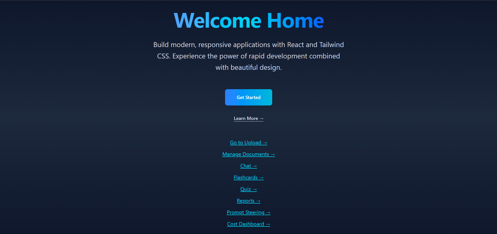
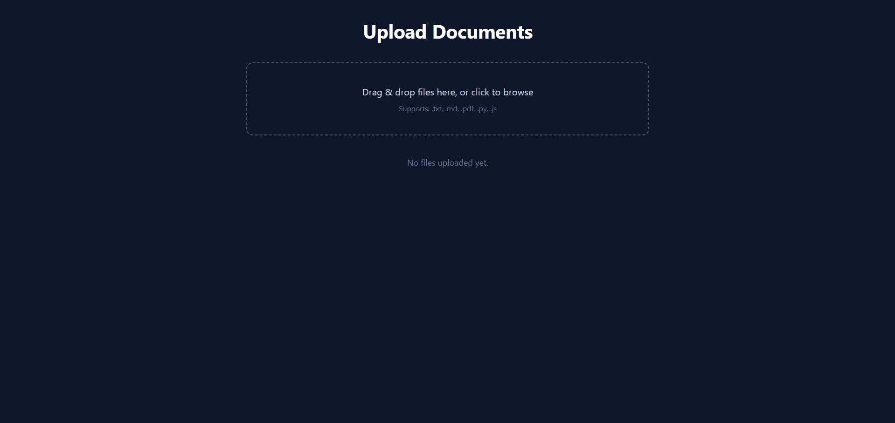
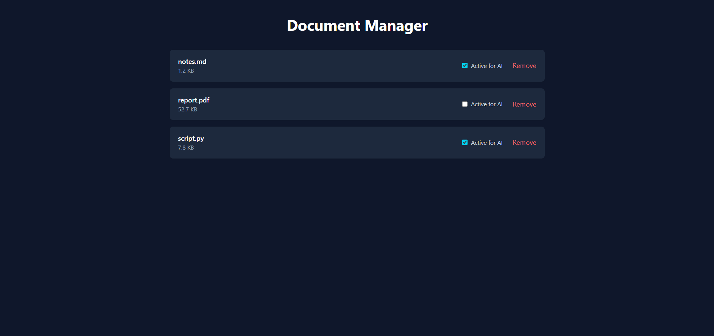
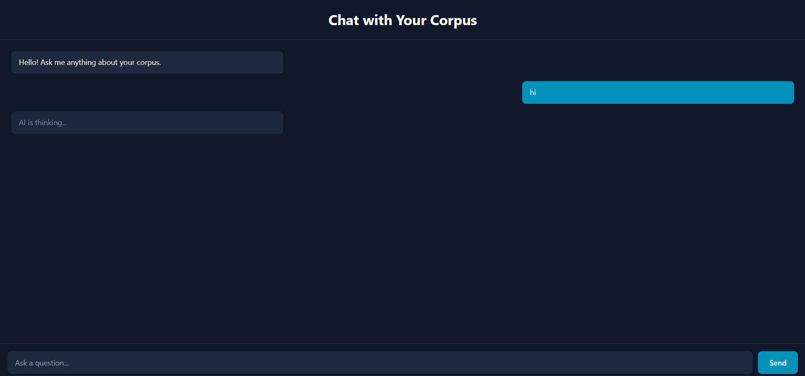
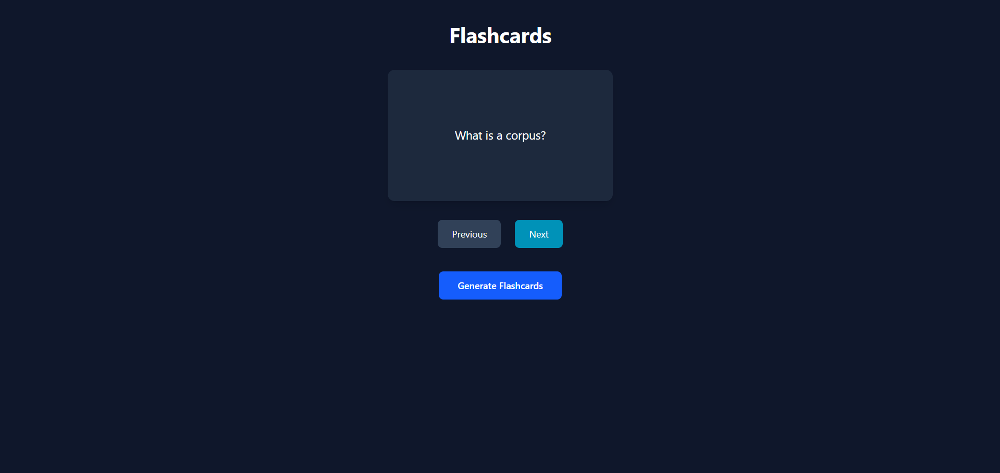
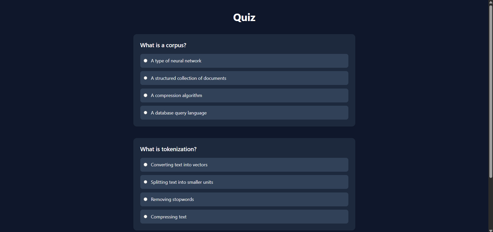
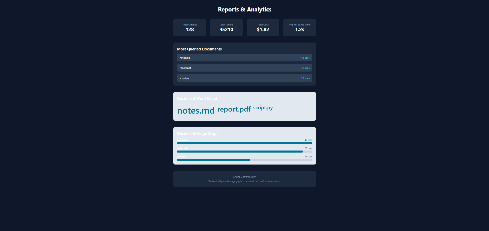
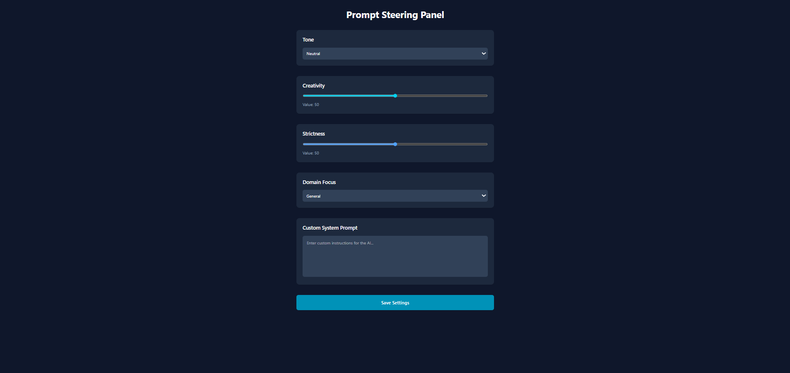
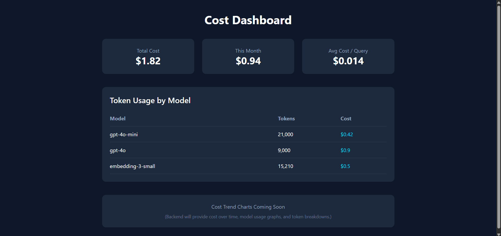

# Corpus Forge Frontend

The full frontend for Corpus Forge lives in this folder. All React pages, routing, styling, and build tooling are contained inside `frontend`, so this directory is the only place you need to work when changing the user interface.

## Project Overview

Corpus Forge is a corpus-centric assistant for managing documents and turning them into interactive experiences. Users can upload content, organize the active corpus, chat with the knowledge base, generate study tools, and review usage analytics from one interface.

The frontend is built as a routed single-page application and is structured around the core product workflows:

- document ingestion and corpus management
- conversational retrieval and AI interaction
- learning tools such as flashcards and quizzes
- reporting and prompt steering for experimentation and control

## Features

- Upload documents into the corpus workspace
- Manage corpus files and mark which documents should be used by AI
- Chat with the corpus through a dedicated conversation screen
- Review flashcards based on corpus concepts
- Take quizzes generated from corpus material
- View reports for usage, activity, and document trends
- Adjust prompt settings and steering preferences for the assistant

## Optional UI Enhancements

- Dark mode styling
- Word cloud visualization in reports
- Graph-style analytics cards and progress bars
- Loading animations and empty-state placeholders

## Tech Stack

- React
- Vite
- TailwindCSS

## Install and Run

From the repository root:

```bash
cd frontend
npm install
npm run dev
```

Vite will print a local development URL in the terminal. Open that URL in your browser to view the app.

## Folder Structure

Everything below is inside the `frontend` folder.

```text
frontend/
├── public/
├── src/
│   ├── App.tsx
│   ├── App.css
│   ├── index.css
│   ├── main.tsx
│   ├── assets/
│   ├── hooks/
│   │   └── useTheme.js
│   └── pages/
│       ├── Chat.jsx
│       ├── CostDashboard.jsx
│       ├── DocumentManager.jsx
│       ├── Flashcards.jsx
│       ├── Home.jsx
│       ├── PromptSteering.jsx
│       ├── Quiz.jsx
│       ├── Reports.jsx
│       └── Upload.jsx
├── index.html
├── package.json
├── postcss.config.cjs
├── tailwind.config.cjs
├── tsconfig.app.json
├── tsconfig.json
├── tsconfig.node.json
└── vite.config.ts
```


### Home



### Upload



### Corpus Manager



### Chat



### Flashcards



### Quiz



### Reports

_

### Prompt Settings



### Cost Dashboard



